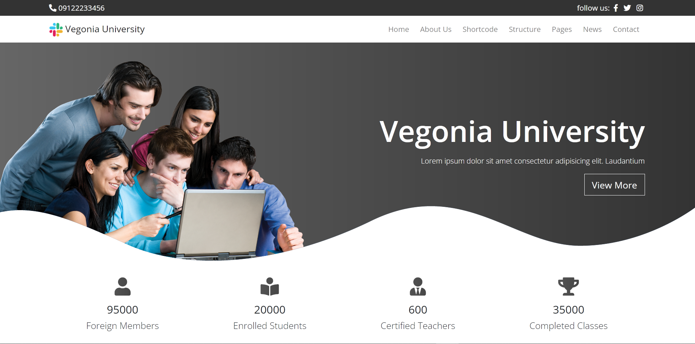
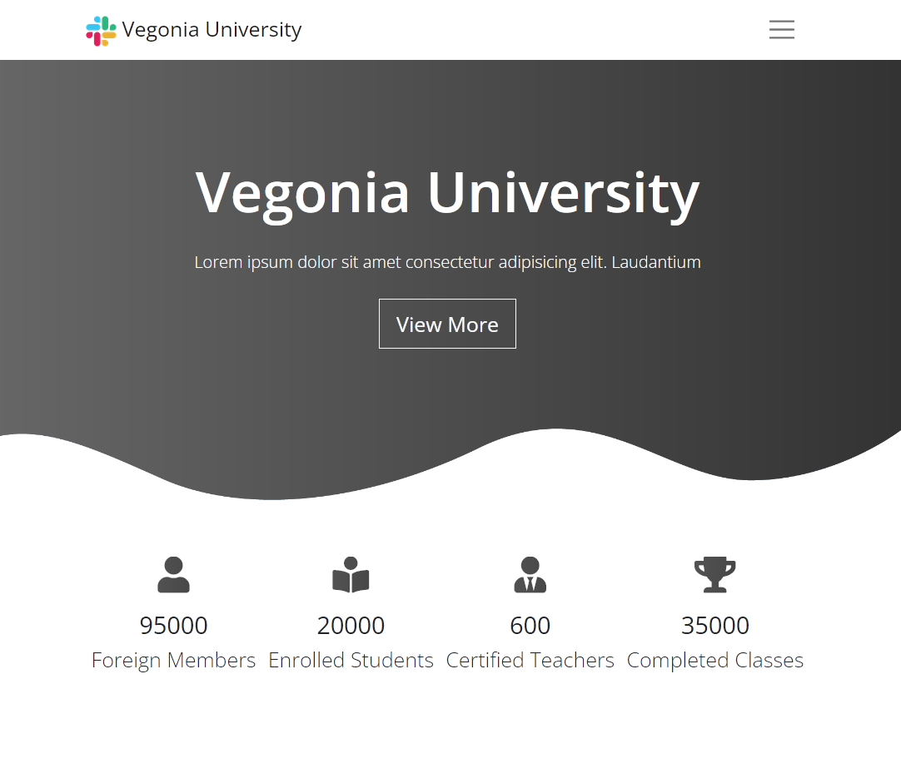
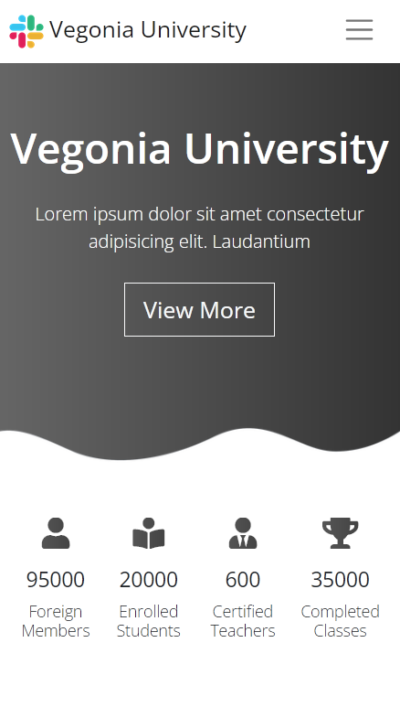

# Vegonia University
This is a simple landing page responsive template for education

## Demo link
Access my site at [Vegonia University](https://merry-crisp-05f17a.netlify.app/)

## Table of contents
-[Screenshots](#screenshots)
-[Teachnologies](#technologies)

## Screenshots

## Technologies
I used
- Semantic HTML
- CSS architecture BEM
- CSS custom styles
- Vanilla JavaScript
- Google Chart API
- Bootstrap v5.2